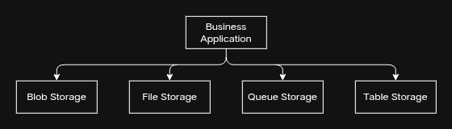

# azure-storage-decision-guide
Beginner Azure Storage Decision Guide with real-world scenarios.
## 📌 Project Overview

This project explains how to choose the right Azure Storage service based on different business needs.

The guide covers:

- Azure Blob Storage
- Azure File Storage
- Azure Queue Storage
- Azure Table Storage
- Real-world use cases
- Storage comparison
- Best practices

This project is designed for Azure beginners preparing for the AZ-900 certification.

## ☁️ Azure Storage Services

### 1. Azure Blob Storage

**Purpose:** Stores large amounts of unstructured data.

**Examples:**
- Images
- Videos
- PDF files
- Backups
- Documents

**Real-world example:**
A photo sharing application stores millions of user images in Azure Blob Storage.

### 2. Azure File Storage

**Purpose:** Provides shared file storage for multiple users.

**Examples:**
- Shared folders
- Team documents
- Company reports

**Real-world example:**
Employees access the same shared folder from different computers.

### 3. Azure Queue Storage

**Purpose:** Stores messages between applications.

**Examples:**
- Order processing
- Email notifications
- Background tasks

**Real-world example:**
An online shopping website stores new orders in a queue before processing them.

### 4. Azure Table Storage

**Purpose:** Stores structured NoSQL data.

**Examples:**
- User profiles
- Product information
- IoT sensor data

**Real-world example:**
An IoT application stores temperature readings from thousands of sensors.

## 📊 Azure Storage Comparison

| Storage Service | Best For | Example |
|-----------------|----------|----------|
| Blob Storage | Images, Videos, Backups | Photo sharing app |
| File Storage | Shared folders | Company documents |
| Queue Storage | Messages between applications | Order processing |
| Table Storage | NoSQL structured data | User profiles |

## ✅ How to Choose the Right Storage

- Choose **Blob Storage** for files such as images, videos, and documents.
- Choose **File Storage** when multiple users need to access the same files.
- Choose **Queue Storage** when applications need to exchange messages.
- Choose **Table Storage** for large amounts of structured NoSQL data.

## ⭐ Best Practices

- Store large files such as images and videos in Azure Blob Storage.
- Use Azure File Storage when files need to be shared across multiple users.
- Use Azure Queue Storage for asynchronous communication between applications.
- Use Azure Table Storage for scalable NoSQL data.
- Choose the storage service based on your application's requirements.
- Enable data backup and monitoring whenever possible.

## 📝 Conclusion

Azure offers multiple storage services, each designed for different business requirements.

Selecting the correct storage service improves application performance, scalability, security, and cost efficiency.

Understanding Azure Storage is an essential skill for cloud professionals and for the Microsoft Azure AZ-900 certification.

## 🏗️ Azure Storage Architecture

The following diagram shows how different Azure Storage services are used in a business application.

## 💼 Interview Questions

### 1. What is Azure Blob Storage?
**Answer:** Azure Blob Storage is designed to store unstructured data such as images, videos, documents, and backup files.

### 2. Which Azure Storage service is best for sharing files?
**Answer:** Azure File Storage is the best choice because it allows multiple users and applications to access the same files.

### 3. Why is Azure Queue Storage important?
**Answer:** It stores messages between applications and supports asynchronous communication.

### 4. What type of data is stored in Azure Table Storage?
**Answer:** Azure Table Storage stores structured NoSQL data with high scalability.

## 📚 References

- Microsoft Learn
- Microsoft Azure Documentation
- AZ-900 Microsoft Azure Fundamentals Learning Path
